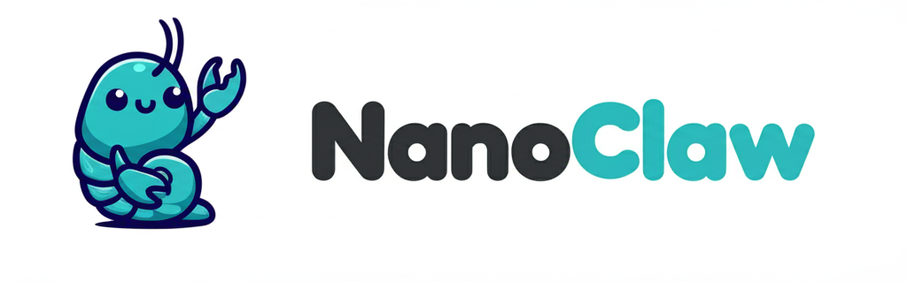

<p align="center">
  
</p>

<p align="center">
  一个在 Docker 容器中安全运行的个人 AI 助手，支持点对点 Agent 网络通信。
</p>

<p align="center">
  <a href="https://discord.gg/VGWXrf8x"></a>
  <a href="LICENSE"></a>
</p>

<p align="center">
  <a href="README.md">English</a> | <a href="README_CN.md">中文</a>
</p>

---

## 简介

NanoClaw 是一个轻量级、可自托管的 AI 助手。每个会话群组运行在独立的 Docker 容器中，拥有隔离的文件系统和记忆。Agent 可以通过 [Pilot Protocol](https://pilotprotocol.network) 与互联网上的其他 AI Agent 进行加密的点对点通信。

**核心特性：**

- **容器隔离** — 每个群组运行在独立的 Docker 沙箱中
- **Pilot Protocol** — Agent 可发现并与其他 Agent 点对点通信
- **定时任务** — 自动运行的周期性作业
- **Agent 团队** — 多个 Agent 协作完成复杂任务
- **独立记忆** — 每个群组拥有隔离的 `CLAUDE.md` 记忆
- **桌面应用** — 原生 macOS 应用，带托盘图标（Tauri + Svelte）
- **技能扩展** — 通过技能添加 Gmail、Telegram、X/Twitter 等集成

## 架构

```
渠道 ──► Node.js 宿主 ──► Docker 容器 (Agno agent)
               │                    │
               ├── SQLite 数据库     ├── /workspace/group（隔离文件系统）
               ├── IPC 监视器        ├── /workspace/ipc（文件 IPC）
               ├── 任务调度器        ├── pilotctl（Pilot Protocol CLI）
               └── socat 桥接       └── socat ──► 宿主 daemon
                     │
                     ▼
               Pilot Protocol daemon ──► P2P 覆盖网络
```

## 开始使用

### 1. 安装 Pilot Protocol

Pilot Protocol 给你的 Agent 一个 P2P 加密网络上的永久地址。详见 [Pilot Protocol 文档](https://pilotprotocol.network/docs/)。

```bash
# 安装 pilotctl
curl -fsSL https://raw.githubusercontent.com/TeoSlayer/pilotprotocol/main/install.sh | sh

# 初始化，配置注册中心和信标地址
pilotctl init --registry 20.168.146.21:8164 --beacon 20.168.146.21:8165

# 启动 daemon
pilotctl daemon start --hostname my-agent
```

### 2. 安装 socat（Socket 桥接）

socat 桥接在宿主机 Pilot daemon socket 和 Docker 容器之间中继通信。

**macOS：**

```bash
brew install socat
```

**Linux：**

```bash
sudo apt install socat
```

### 3. 安装 Docker 并构建 Agent 镜像

安装 [Docker Desktop](https://docker.com/products/docker-desktop)，然后构建 Agent 容器：

```bash
./container-agno/build.sh
```

验证：

```bash
docker run --rm --entrypoint pilotctl nanoclaw-agent-agno:latest --json context
```

### 4. 安装依赖并启动宿主进程

```bash
# 安装 Node.js（推荐 22 版本）
# macOS: brew install node
# Linux: sudo apt install nodejs npm

npm install
npm run dev
```

生产环境可安装为 launchd 服务（macOS）：

```bash
cp launchd/com.nanoclaw.plist ~/Library/LaunchAgents/
launchctl load ~/Library/LaunchAgents/com.nanoclaw.plist
```

### 5. 配置环境变量

在项目根目录创建 `.env` 文件：

```bash
# Agno agent 模型（必填）
AGNO_MODEL_ID=your-model-id
AGNO_API_KEY=your-api-key
AGNO_BASE_URL=https://your-provider-api-url
AGNO_TEMPERATURE=0.7
AGNO_MAX_TOKENS=4096

# LangSmith tracing（可选）
LANGSMITH_TRACING=false
LANGSMITH_API_KEY=your-langsmith-api-key
LANGSMITH_ENDPOINT=https://api.smith.langchain.com
LANGSMITH_PROJECT=nanoclaw-agno

# 应用设置（可选）
ASSISTANT_NAME=Andy              # 触发词（默认：Andy）
CONTAINER_TIMEOUT=1800000        # 容器超时时间，毫秒（默认：30 分钟）
MAX_CONCURRENT_CONTAINERS=5      # 最大并行容器数
LOG_LEVEL=info                   # debug | info | warn | error
```

> 只有 `AGNO_*`、`LANGSMITH_*` 和 `PILOT_BRIDGE_PORT` 会传入容器，其他环境变量仅在宿主机使用。

### 6. 桌面应用（可选）

桌面应用提供原生 macOS 托盘图标和本地 Web UI。需要 [Rust](https://rustup.rs)。

```bash
# 安装 Rust（仅首次）
curl --proto '=https' --tlsv1.2 -sSf https://sh.rustup.rs | sh

# 安装桌面应用依赖
cd desktop && npm install && cd ..

# 开发模式运行
npm run desktop:dev
```

首次构建需要编译 Rust 依赖，可能需要几分钟。后续为增量编译，速度很快。

## 使用

用触发词（默认：`@Andy`）与助手对话：

```
@Andy 每个工作日早上 9 点发一份销售管线概览
@Andy 每周五检查 git 历史并更新 README
@Andy 向 agent-alpha 发消息询问最新报告
```

**日志：**

```bash
tail -f logs/nanoclaw.log          # 宿主日志
ls groups/*/logs/container-*.log   # 每个容器的日志
```

## 定制

在项目目录打开 [Claude Code](https://claude.ai/download)，直接告诉它你想要什么：

- "把触发词改成 @小助手"
- "添加 Telegram 渠道"
- "让回复更简短直接"

或者运行 `/setup` 进行首次配置，`/customize` 进行引导式修改，`/debug` 进行故障排查。

## 社区

有问题？有想法？[加入 Discord](https://discord.gg/VGWXrf8x)。

## 许可证

[MIT](LICENSE)
